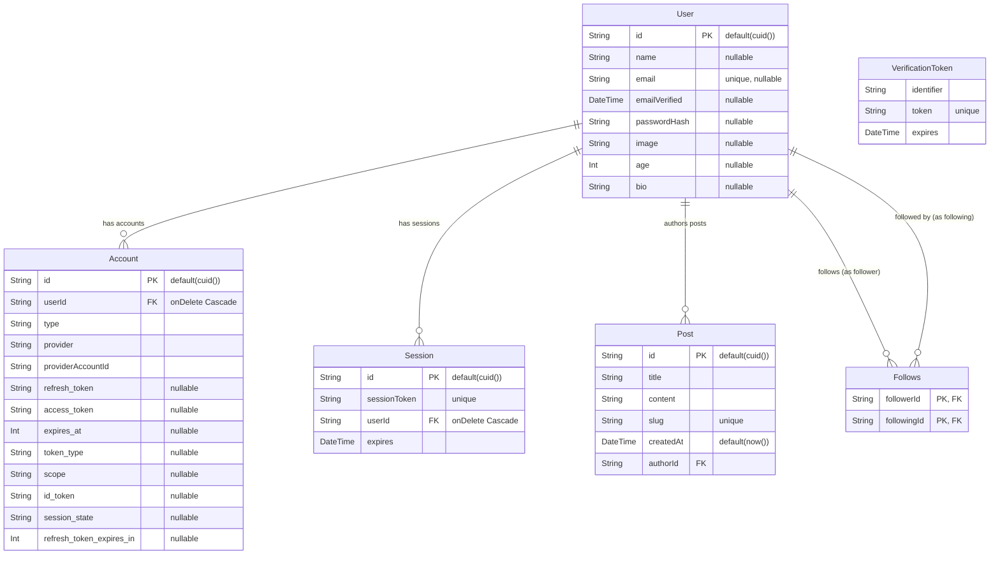
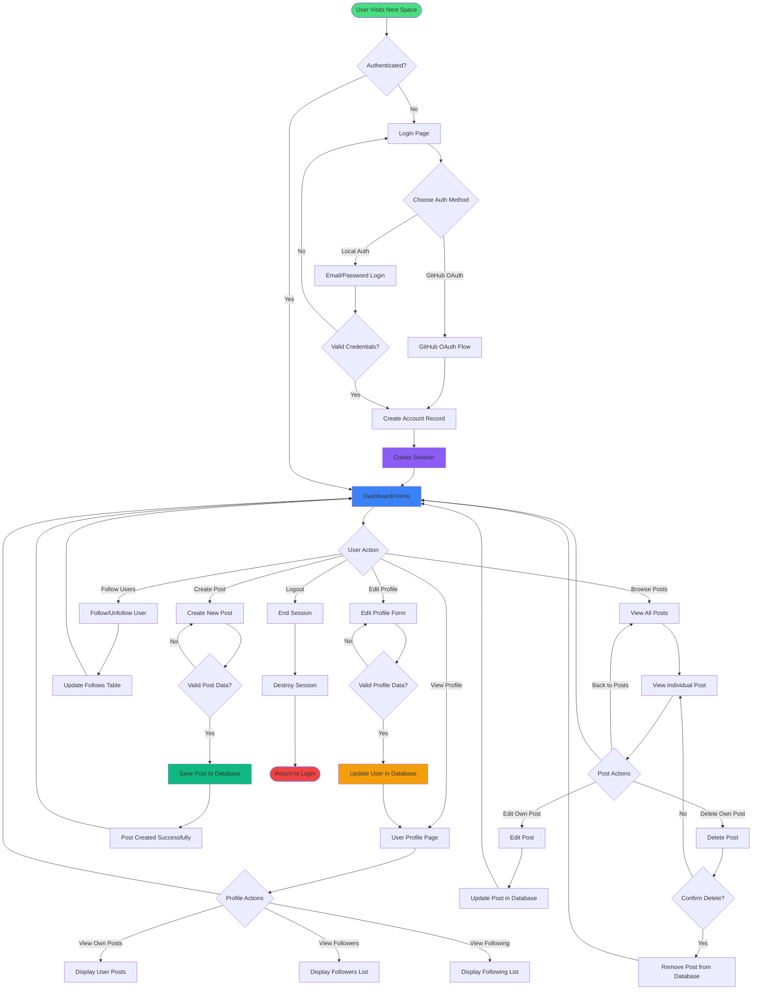

# Next Space


[](https://nextjs.org/)
[](https://www.typescriptlang.org/)
[](https://next-auth.js.org/)
[](https://www.prisma.io/)
[](https://cloudinary.com/)
[](https://www.postgresql.org/)
[](https://vercel.com/)
[](https://github.com/)

## 🚀 About

Next Space is a modern social platform built with the latest technologies in the Next.js ecosystem. It features secure authentication, social following, content creation, database management, and seamless deployment capabilities.

## ✨ Features

- 🔐 **Authentication** - Secure user authentication with NextAuth.js and GitHub OAuth
- 👥 **Social Features** - Follow/unfollow users and build your network
- 📝 **Content Creation** - Create, edit, and manage blog posts
- 🎨 **Modern UI** - Built with React and styled components
- 📊 **Database** - Prisma ORM for type-safe database operations
- 🚀 **Performance** - Optimized with Next.js 14+ features
- 📱 **Responsive** - Mobile-first design approach
- ⚡ **Type Safety** - Full TypeScript support
- 🌐 **Deployment** - Ready for Vercel deployment
- 📸 **Media Management** - Cloudinary integration for image/video assets

## 🛠️ Tech Stack

- **Framework:** Next.js 14+
- **Language:** TypeScript
- **Authentication:** NextAuth.js with GitHub OAuth
- **Database:** PostgreSQL
- **Database ORM:** Prisma
- **Media Storage:** Cloudinary
- **Deployment:** Vercel
- **Styling:** [Your styling solution]

## 📦 Getting Started

### Prerequisites

- Node.js 18+ 
- npm/yarn/pnpm
- PostgreSQL database
- Cloudinary account (for media management)
- GitHub OAuth App credentials

### Installation

1. Clone the repository
```bash
git clone https://github.com/yourusername/next-space.git
cd next-space
```

2. Install dependencies
```bash
npm install
# or
yarn install
# or
pnpm install
```

3. Set up environment variables
```bash
cp .env.example .env.local
```

Configure your `.env.local` file:
```env
POSTGRES_PRISMA_URL="your-postgres-database-url"
NEXTAUTH_URL="http://localhost:3000"
NEXTAUTH_SECRET="your-secret-key"
GITHUB_ID="your-github-oauth-id"
GITHUB_SECRET="your-github-oauth-secret"
CLOUDINARY_CLOUD_NAME="your-cloudinary-cloud-name"
CLOUDINARY_API_KEY="your-cloudinary-api-key"
CLOUDINARY_API_SECRET="your-cloudinary-api-secret"
```

4. Set up the database
```bash
npx prisma migrate dev
npx prisma generate
```

5. Run the development server
```bash
npm run dev
# or
yarn dev
# or
pnpm dev
```

Open [http://localhost:3000](http://localhost:3000) in your browser.

## 🗄️ Database Schema

### Entity Relationship Diagram



### Schema Details

The database consists of 6 main models:

- **User**: Core user entity with profile information (name, email, bio, age, image, password hash)
- **Account**: OAuth provider accounts linked to users (GitHub OAuth integration)
- **Session**: User session management with expiration tracking
- **Post**: Blog posts or content created by users with unique slugs
- **Follows**: Many-to-many self-referential relationship for user following system
- **VerificationToken**: Email verification and password reset tokens

### Relationships

- A User can have multiple Accounts (OAuth providers)
- A User can have multiple Sessions (concurrent logins)
- A User can create multiple Posts (authored content)
- Users can follow other Users (many-to-many through Follows table)
- All User-related data cascades on deletion for Accounts and Sessions

## 📊 Application Flow

### User Journey Flowchart



### Flow Description

The application provides a complete social platform experience:

1. **Authentication Flow**: Users can authenticate via GitHub OAuth or local credentials
2. **Session Management**: Secure session creation and management with expiration
3. **Profile Management**: Users can view and edit their profiles, including bio, age, and image
4. **Content Creation**: Create, edit, and delete blog posts with validation
5. **Social Features**: Follow/unfollow other users and view followers/following lists
6. **Navigation**: Seamless navigation between dashboard, profile, and posts

## 🔐 Authentication

This project uses NextAuth.js with GitHub OAuth provider. To set up authentication:

1. Create a GitHub OAuth App at https://github.com/settings/developers
2. Add the Client ID and Client Secret to your `.env.local`
3. Configure callback URL: `http://localhost:3000/api/auth/callback/github`

### Local Authentication

The application also supports local authentication with email and password:
- Passwords are hashed using bcrypt or similar
- Store the hash in the `passwordHash` field of the User model

## 📸 Cloudinary Setup

1. Create an account at [Cloudinary](https://cloudinary.com/)
2. Get your Cloud Name, API Key, and API Secret from the dashboard
3. Add them to your `.env.local` file
4. Use the Cloudinary SDK for uploading images and videos

## 🚀 Deployment

### Deploy on Vercel

The easiest way to deploy your Next.js app is to use the Vercel Platform.

[](https://vercel.com/new/clone?repository-url=https://github.com/yourusername/next-space)

1. Push your code to GitHub
2. Import your repository in Vercel
3. Add environment variables:
   - `POSTGRES_PRISMA_URL`
   - `NEXTAUTH_URL`
   - `NEXTAUTH_SECRET`
   - `GITHUB_ID`
   - `GITHUB_SECRET`
   - `CLOUDINARY_CLOUD_NAME`
   - `CLOUDINARY_API_KEY`
   - `CLOUDINARY_API_SECRET`
4. Deploy!

### Database Setup on Production

Make sure to run migrations on your production database:
```bash
npx prisma migrate deploy
```

## 📝 Scripts

- `npm run dev` - Start development server
- `npm run build` - Build for production
- `npm start` - Start production server
- `npm run lint` - Run ESLint
- `npx prisma studio` - Open Prisma Studio
- `npx prisma migrate dev` - Create and apply migrations
- `npx prisma generate` - Generate Prisma Client
- `npx prisma migrate deploy` - Apply migrations in production

## 🎯 Key Features Explained

### Social Following System

The Follows model creates a many-to-many self-referential relationship:
- Users can follow other users
- Users can be followed by other users
- The composite key ensures no duplicate follows
- Bidirectional querying for followers and following lists

### Post Management

Posts include:
- Unique slugs for SEO-friendly URLs
- Author relationship to Users
- Timestamps for creation tracking
- Full CRUD operations

### Authentication Strategy

Multiple authentication methods:
- OAuth providers (GitHub)
- Local email/password authentication
- Session-based authentication with NextAuth.js
- Secure token management

## 🤝 Contributing

Contributions are welcome! Please feel free to submit a Pull Request.

1. Fork the repository
2. Create your feature branch (`git checkout -b feature/AmazingFeature`)
3. Commit your changes (`git commit -m 'Add some AmazingFeature'`)
4. Push to the branch (`git push origin feature/AmazingFeature`)
5. Open a Pull Request

## 📄 License

This project is licensed under the MIT License - see the LICENSE file for details.

## 👤 Author

**Your Name**

- GitHub: [@yourusername](https://github.com/yourusername)
- Website: [your-website.com](https://your-website.com)

## 🙏 Acknowledgments

- Next.js team for the amazing framework
- Prisma team for the excellent ORM
- NextAuth.js for authentication solution
- Vercel for hosting platform
- Cloudinary for media management
- PostgreSQL for robust database system

## 📞 Support

If you have any questions or need help, feel free to:
- Open an issue on GitHub
- Contact via email
- Check the documentation

---

⭐ Star this repo if you find it helpful!
